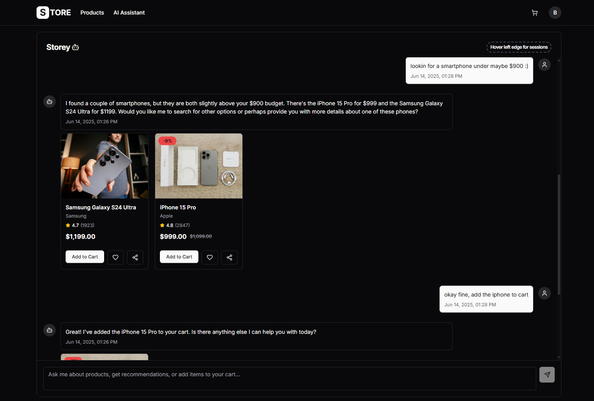
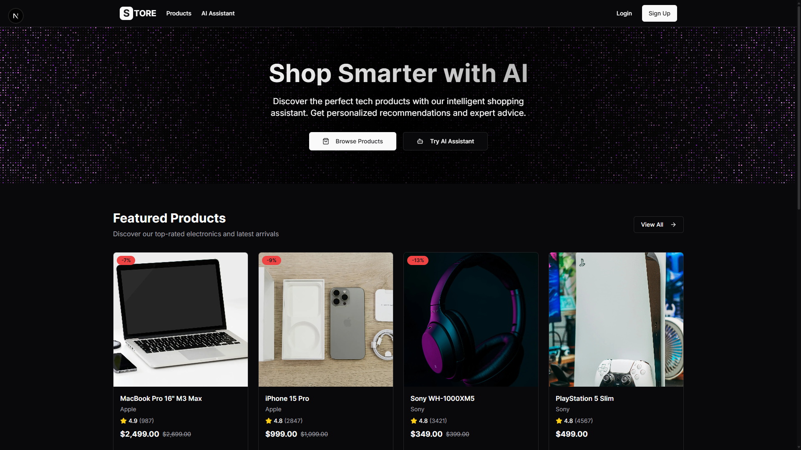

# S-TORE: AI-Powered E-commerce Platform

A full-stack e-commerce platform featuring an intelligent AI shopping assistant, vector-based product search with Pinecone, and a modern React/Next.js frontend. **Chatbot with advanced product search, recommendations, and order/cart management.**




## Features

### **AI Shopping Assistant**

- Natural language product search and recommendations
- State-of-the-art AI with 1M token context window
- Advanced conversation memory and tool orchestration
- AI-driven product suggestions based on user behavior

### **Advanced Search & Discovery**

- Vector-based product discovery using Pinecone
- Find products by description, features, or use cases
- Price range, brand, category, ratings, and availability
- Context-aware product suggestions

### **Complete E-commerce Experience**

- Persistent cart with real-time updates
- Favorites, likes, and personalized settings
- Real-time stock management and availability

## Architecture

```
├── Frontend (Next.js)
│   ├── Modern UI
│   ├── Responsive design & animations
│   ├── Real-time chat interface
│   └── Shopping cart & product pages
│
├── Backend API (Flask + Python)
│   ├── RESTful API endpoints
│   ├── JWT authentication
│   ├── Database models & services
│   └── AI chatbot integration
│
├── AI Services
│   ├── Google Gemini Flash 2.0
│   ├── LangChain orchestration
│   ├── Pinecone vector database
│   └── Sentence Transformers
│
└── Data Layer
    ├── SQLite database (for dev)
    ├── Vector embeddings
    └── Session management
```

## Quick Start

### Prerequisites

- **Node.js** 18+ (for frontend)
- **Python** 3.12+ (for backend)
- **Google AI Studio** API key
- **Pinecone** account and API key

### Tech

- **Language Model**: Google Gemini Flash 2.0
- **Framework**: LangChain for orchestration
- **Vector Database**: Pinecone for semantic search
- **Embeddings**: Sentence Transformers

### Development Guidelines

- Follow TypeScript/Python best practices
- Add tests for new features
- Update documentation
- Ensure code passes linting

## License

This project is licensed under the **MIT License** - see the [LICENSE](LICENSE) file for details.
